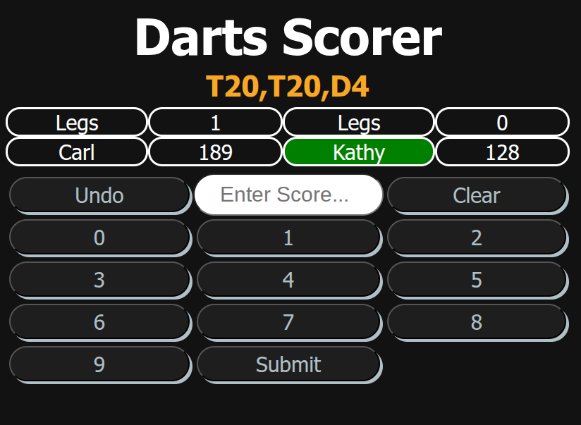

# Darts Scorer
## Description
 2 Player Darts Scorer built with vanilla javascript. Players can enter custom names, choose between 3 starting scores, view checkout suggestion and track legs won. This was my first project built since learning HTML, CSS and Vanilla Javascript.
## Screenshot
 
## Features
- 2-player score tracking
- Bust detection logic
- Checkout suggestion
- Leg win tracking
- Undo last score button
- Dynamic UI updates
## Tech Stack
- HTML5
- CSS3
- Vanilla Javascript
## Installation
- Clone the repository: git clone https://github.com/Carlw125/dart-scorer.git
- Navigate into project folder.
- Open dartScorer.html in your browser.
## How It Works
- Firstly, player names, starting score (Choice of 301, 501, 1001) and who throws first are chosen.
- Then the game begins. Inputs are validated and then score subtracted. Checkout suggestions appear when the current player is on a possible checkout. Bust logic checks if a player has landed on 1 or below 0. Turn switches automatically. New leg starts automatically after a player wins. All updates on the page are handled with DOM mainipulation.
## Future Improvements
- Best of 3, 5 or 7 legs
- Set play
- Statistics(3 dart average, doubles success percentage).
- Add pop out boxes with animation for certain circumstances (180 max score hit, high checkout, leg win).
## Author
Built by Carl Wright
Section Manager | Self-Taught Developer
10+ Years asphalt plant/leadership experience trying to transition into software development.